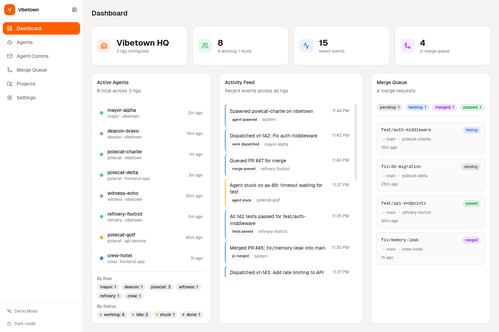
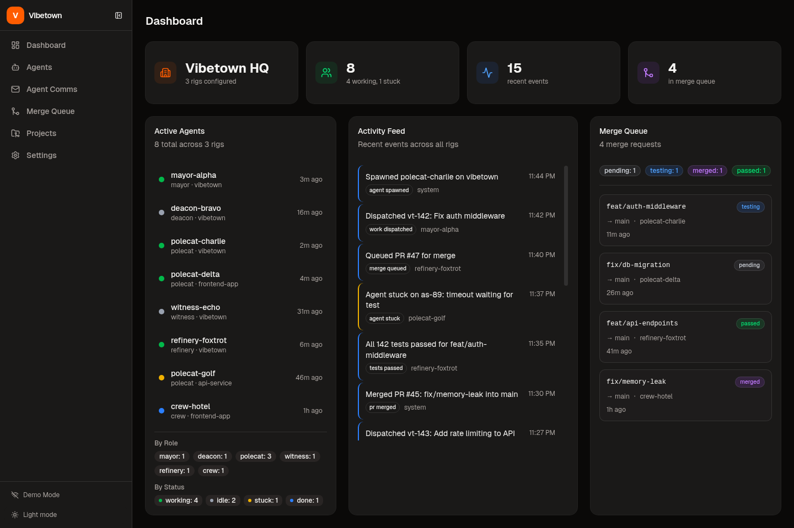
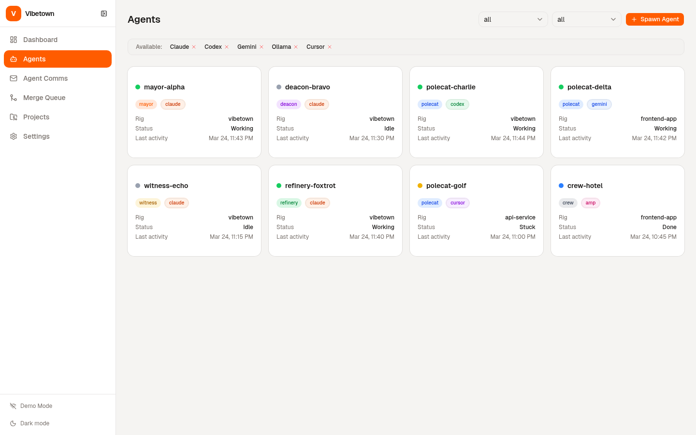
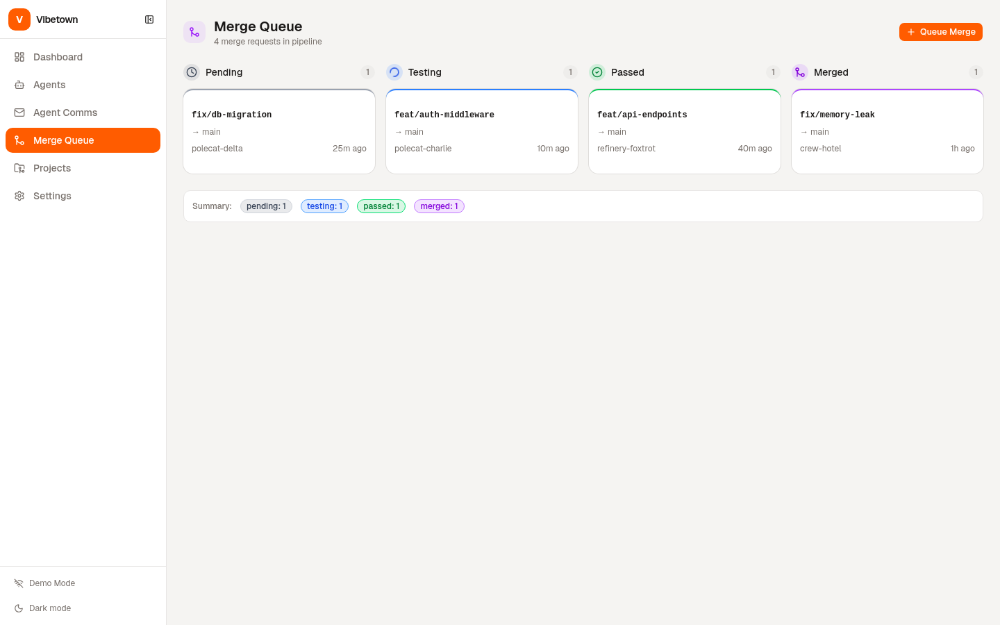
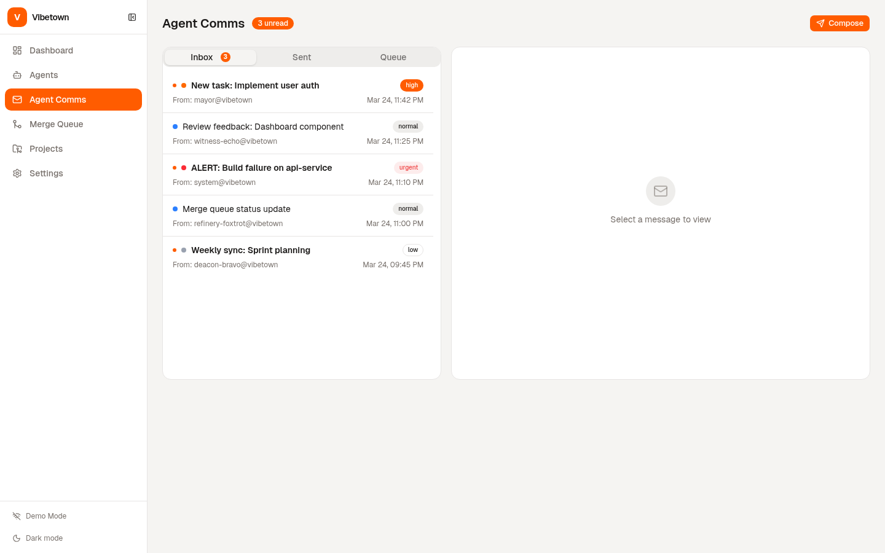

<p align="center">
  <h1 align="center">vibetown</h1>
  <p align="center">
    An all-in-one workspace for AI-assisted software development.<br/>
    Plan. Dispatch. Monitor. Merge.
  </p>
</p>

<p align="center">
  <a href="#screenshots">Screenshots</a> &middot;
  <a href="#quick-start">Quick Start</a> &middot;
  <a href="#architecture">Architecture</a> &middot;
  <a href="#deployment">Deployment</a> &middot;
  <a href="#development">Development</a> &middot;
  <a href="docs/architecture.md">Docs</a>
</p>

---

Plan work on a kanban board, dispatch it to coding agents — **Claude Code**, **Codex**, **Gemini**, **Copilot**, **Cursor**, **AMP**, **OpenCode**, **Qwen**, **Droid** — monitor progress in real time, review diffs, and merge. All from a single interface.

Built for engineers running **10–50+ agents** simultaneously across multiple projects.

## Screenshots

<table>
  <tr>
    <td><b>Dashboard</b></td>
    <td><b>Dashboard (Dark)</b></td>
  </tr>
  <tr>
    <td></td>
    <td></td>
  </tr>
  <tr>
    <td><b>Agent Management</b></td>
    <td><b>Merge Queue</b></td>
  </tr>
  <tr>
    <td></td>
    <td></td>
  </tr>
  <tr>
    <td colspan="2"><b>Agent Comms (Inter-agent messaging)</b></td>
  </tr>
  <tr>
    <td colspan="2"></td>
  </tr>
</table>

## Features

- **Orchestration dashboard** — spawn agents, track convoys, manage rigs across repos
- **Kanban board** — unified work items (tasks, messages, merge requests, molecules)
- **Multi-agent coordination** — inter-agent mail, event feeds, convoy tracking
- **Merge queue** — review diffs and merge from the UI
- **10+ agent runtimes** — plug in any coding agent via executor adapters
- **Real-time streaming** — gRPC event stream piped to WebSocket for live updates

## Architecture

```
Browser
  │
  │  HTTP / WebSocket
  ▼
┌──────────────────────────────────────────────┐
│  Kubernetes Pod                               │
│                                               │
│  ┌─────────────────────────────────────────┐ │
│  │  Rust Server (Axum)             :3000   │ │
│  │  REST API · WebSocket · SQLx            │ │
│  │  Agent executors · Embedded frontend    │ │
│  └──────────────┬──────────────────────────┘ │
│                 │ gRPC                        │
│  ┌──────────────┴──────────────────────────┐ │
│  │  Go Engine (Gastown)            :50051  │ │
│  │  Orchestration · Feed · Mail            │ │
│  │  Daemon · Scheduling · Health           │ │
│  └─────────────────────────────────────────┘ │
│                                               │
│  Shared volume: git worktrees                 │
└──────────────────────────────────────────────┘
                  │
        ┌─────────┴─────────┐
        │  PostgreSQL / SQLite │
        └─────────────────────┘
```

| Component | Language | Port | Role |
|-----------|----------|------|------|
| **Engine** | Go 1.25 | 50051 (gRPC) | Agent orchestration, convoys, feeds, mail |
| **Server** | Rust (nightly) | 3000 (HTTP) | REST API, WebSocket, DB, executor adapters |
| **Web** | TypeScript / React 19 | 5173 (dev) | Dashboard, kanban, agent management |

## Quick Start

### Prerequisites

| Tool | Version | Install |
|------|---------|---------|
| Go | 1.25+ | `brew install go` |
| Rust | nightly-2025-12-04 | `rustup` (pinned in `rust-toolchain.toml`) |
| Node.js | 20+ | `brew install node` |
| pnpm | 10+ | `corepack enable` |
| Docker | Compose v2 | [docker.com](https://docker.com) |
| buf | latest | `brew install bufbuild/buf/buf` |

```bash
# Verify everything is installed
make check-tools

# Install dependencies
make install

# Start all services (Docker Compose)
make dev
```

Or run each service individually:

```bash
make dev-engine   # Go engine on :50051
make dev-server   # Rust server on :3000
make dev-web      # React frontend on :5173
```

## Project Structure

```
vibetown/
├── engine/           Go orchestration engine (gRPC services)
│   └── internal/     grpcapi, daemon, agent roles, convoy, feed, mail
├── server/           Rust API server (16 crates)
│   └── crates/       server, db, executors, services, git, deployment, ...
├── web/              React frontend (pnpm monorepo)
│   └── packages/     app, ui (shadcn), web-core (hooks + API client)
├── proto/            Protobuf definitions
│   └── vibetown/     orchestration/v1, feed/v1, mail/v1
├── deploy/
│   ├── docker/       Dockerfiles (engine, server, web)
│   ├── helm/         Helm chart with values + templates
│   └── kustomize/    Kustomize base + overlays (dev, production)
├── tests/            E2E API test suite
├── tools/            Dev scripts (dev.sh, migrate.sh)
└── docs/             Architecture and developer guide
```

## Development

### Build

```bash
make build            # All
make build-engine     # Go binary → engine/bin/vibetown-engine
make build-server     # Rust release → server/target/release/server
make build-web        # React → web/packages/app/dist/
```

### Test

```bash
make test             # All
make test-engine      # Go unit tests
make test-server      # Rust unit tests
make test-web         # TypeScript type checks
make test-grpc        # gRPC integration (Rust ↔ Go)
make test-e2e         # E2E API tests (requires running server)
```

### Lint

```bash
make lint             # go vet + cargo clippy + pnpm lint + buf lint
```

### Proto

```bash
make proto            # Regenerate Go code from .proto files
make proto-lint       # Lint proto definitions
```

## Deployment

Three deployment options depending on your environment:

### Docker Compose

Best for local development and single-machine setups.

```bash
make docker-up        # Start postgres, engine, server, web
make docker-down      # Tear down
```

### Helm

Best for production Kubernetes clusters with full configurability.

```bash
helm install vibetown deploy/helm/vibetown \
  --set postgres.host=your-db-host \
  --set postgres.existingSecret=your-db-secret \
  --set ingress.enabled=true \
  --set ingress.hosts[0].host=vibetown.yourcompany.com
```

### Kustomize

Best for GitOps workflows and teams that prefer plain manifests over templating.

```bash
# Preview rendered manifests
make kustomize-build

# Deploy dev overlay (debug logging, reduced resources)
make kustomize-dev

# Deploy production overlay (HPA, ingress, PVC, higher limits)
make kustomize-prod
```

Overlays available in `deploy/kustomize/overlays/`:

| Overlay | Replicas | Log Level | Storage | Extras |
|---------|----------|-----------|---------|--------|
| **dev** | 1 | debug | emptyDir | Reduced CPU/memory |
| **production** | 2 | warn | PVC (10Gi) | HPA (2–10), Ingress + TLS |

## Environment Variables

| Variable | Default | Description |
|----------|---------|-------------|
| `VT_DATABASE_URL` | `sqlite://vibetown.db` | Database connection string |
| `VT_ENGINE_GRPC_ADDR` | `localhost:50051` | Go engine gRPC endpoint |
| `VT_PORT` | `3000` | HTTP server port |
| `VT_LOG_LEVEL` | `info` | Log level (debug, info, warn, error) |
| `VT_DEFAULT_AGENT` | `claude` | Default agent runtime |

## Supported Agent Runtimes

| Runtime | Mode | Executor |
|---------|------|----------|
| Claude Code | Interactive + Autonomous | `claude.rs` |
| Codex | Interactive | `codex.rs` |
| Gemini | Interactive | `gemini.rs` |
| Cursor | Interactive | `cursor.rs` |
| Copilot | Interactive | `copilot.rs` |
| AMP | Interactive | `amp.rs` |
| OpenCode | Interactive | `opencode.rs` |
| Qwen | Interactive | `qwen.rs` |
| Droid | Interactive | `droid.rs` |

## Contributing

1. Fork the repo
2. Create a feature branch (`git checkout -b feature/my-change`)
3. Run tests (`make test && make lint`)
4. Open a pull request

See the [Developer Guide](docs/developer-guide.md) for detailed contribution workflows.

## License

MIT &copy; [edicorAi](https://github.com/edicorAi)
